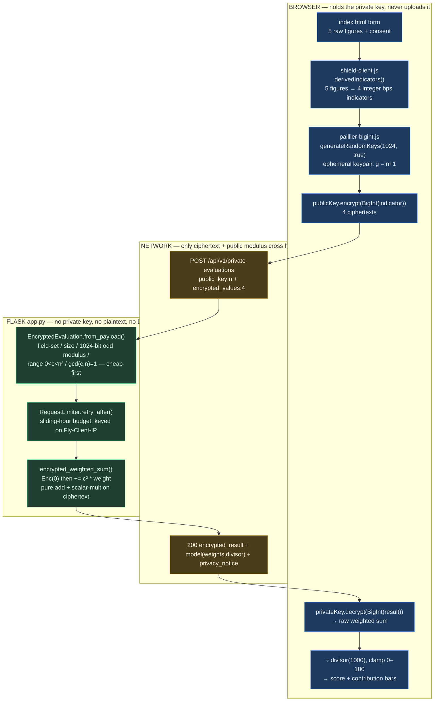

# ShieldAI — current implementation context

> Release context updated **14 September 2026 IST**. Canonical repository: `D:\Code\ShieldAI` (branch `redesign-glass`). Public demo: `https://shieldai-abheet19.fly.dev`; `/version` is the authoritative source-commit proof. Never infer the running deployment from repository configuration or a reachable older image. Current source and executable tests win if an older design note disagrees.
>
> This file is written to be handed to an external AI or a reader with no prior exposure to the repo: it defines every load-bearing term, walks the architecture, and ends with likely interview questions and answers.

## One-paragraph summary

ShieldAI is an educational demonstration of **Paillier partially homomorphic encryption (PHE)**. A person enters five synthetic financial figures in the browser; the browser derives four bounded integer indicators, generates a fresh 1024-bit Paillier keypair _in memory_, encrypts the indicators, and sends only the public modulus plus four ciphertexts to a Flask server. The server computes a transparent weighted sum **directly on the ciphertext** — it never has the private key and never sees a plaintext value — and returns an encrypted total. The browser decrypts that total locally, normalizes it to a 0–100 synthetic "pressure indicator", and renders it with a contribution breakdown and a privacy receipt. It is **not** AI, a trained model, a credit score, an eligibility or lending decision, or production-grade cryptography.

**Core concept, stated plainly:** normally, to have a server compute anything about your data, you must first hand the server your data. Homomorphic encryption breaks that requirement: it lets a server do arithmetic on encrypted numbers and produce an encrypted answer, without ever decrypting anything. ShieldAI is a concrete, working instance of that idea — the server adds and scales your encrypted financial indicators to produce an encrypted score, and only your browser (which alone holds the decryption key) can read either the inputs or the answer.

## The problem it solves

Every "enter your income and we'll evaluate you" form asks you to send raw financial data to a server you do not control. Even when that server is honest, your data is now _somewhere else_ — logged, cached, replicated, and breachable. The usual privacy tools do not fix this: TLS only protects data _in transit_ (the server still decrypts and sees plaintext), and hashing destroys the numbers so no arithmetic is possible. ShieldAI demonstrates the third option — **compute on data that stays encrypted the entire time** — so a weighted score can be produced by a server that is structurally and cryptographically unable to read the inputs or the result. The scenario (a synthetic financial "pressure indicator") is a familiar, motivating stand-in; the transferable idea is the privacy boundary, not the score.

## Trending / load-bearing terms, explained

| Term                                                       | Plain-English meaning as used here                                                                                                                                                                                                                               |
| ---------------------------------------------------------- | ---------------------------------------------------------------------------------------------------------------------------------------------------------------------------------------------------------------------------------------------------------------- |
| **Homomorphic encryption (HE)**                            | Encryption that lets you compute on ciphertext and get an encrypted result equal to computing on the plaintext. _Fully_ HE supports arbitrary add+multiply; ShieldAI uses **partial** HE.                                                                        |
| **Partially homomorphic (PHE)**                            | Supports one operation family. Paillier is _additively_ homomorphic: you can add two ciphertexts and multiply a ciphertext by a known plaintext constant — exactly what a linear weighted sum needs.                                                             |
| **Paillier cryptosystem**                                  | A 1999 public-key scheme where `Enc(a)·Enc(b) mod n² = Enc(a+b)` and `Enc(a)^k mod n² = Enc(k·a)`. Security rests on the decisional composite residuosity assumption.                                                                                            |
| **Public modulus `n`**                                     | The public key. Here it must be an odd 1024-bit integer; the server rebuilds a `PaillierPublicKey` from it to do the arithmetic.                                                                                                                                 |
| **Ciphertext**                                             | A big integer in the range `0 < c < n²`, coprime with `n`. The four encrypted indicators and the encrypted result are all ciphertexts.                                                                                                                           |
| **Ephemeral key**                                          | A key generated for a single use and then discarded. ShieldAI makes a new keypair per evaluation; there is no long-lived private key to persist, transmit, or rotate.                                                                                            |
| **Honest-but-curious (semi-honest) threat model**          | The server follows the protocol but might try to learn from what it sees. PHE defends against exactly this: the curious server sees only ciphertext. It does **not** defend against a malicious _client_ lying about its plaintext.                              |
| **Zero-knowledge / range proof (absent here, on purpose)** | A proof that a ciphertext encrypts a value in a valid range without revealing it. ShieldAI has none, so client-supplied ciphertexts are not proof of honest bounded inputs — a stated limitation.                                                                |
| **bps (basis points)**                                     | 1 bps = 0.01%. Indicators are scaled to integer basis points because Paillier operates on integers.                                                                                                                                                              |
| **Decisional composite residuosity assumption (DCRA)**     | The hardness assumption Paillier's security rests on: deciding whether a number is an `n`-th residue modulo `n²` is believed computationally infeasible without the private key. Plainly — you cannot tell what a ciphertext encrypts from the ciphertext alone. |
| **Modular exponentiation / `mod n²`**                      | Raising a big integer to a power and taking the remainder modulo `n²` (the squared modulus). This is the actual CPU-bound arithmetic behind "scalar-multiply a ciphertext," and why the endpoint rejects malformed input _before_ doing any of it.               |
| **Coprimality (`gcd(c, n) = 1`)**                          | Two integers are coprime when their greatest common divisor is 1. A valid Paillier ciphertext must be coprime with the modulus `n`; the server checks this cheaply to reject garbage before expensive math.                                                      |
| **Derived indicator**                                      | One of the four bounded integers the browser computes from the five raw figures (debt-to-income bps, loan-to-income bps, utilization bps, stability-gap months). These — not the raw figures — are what gets encrypted and sent.                                 |
| **Normalization divisor**                                  | The public constant (1000) the browser divides the decrypted weighted sum by to land the score on a 0–100 scale. Published in the server response so the client math is transparent, not hidden.                                                                 |
| **Application factory (`create_app`)**                     | A Flask pattern where the app is built by a function rather than a module global, so each test gets a fresh, isolated instance (e.g. with a custom evaluation limit). Used here for clean, independent backend tests.                                            |
| **Sliding-window rate limit**                              | The quota keeps a per-client timestamp deque and, on each request, drops entries older than one hour before counting — so the window slides continuously rather than resetting on a fixed clock boundary.                                                        |
| **Trusted proxy header (`Fly-Client-IP`)**                 | The real client IP stamped by Fly's own edge proxy. The quota keys off this rather than a user-supplied `X-Forwarded-For`, which any client can spoof.                                                                                                           |
| **`Server-Timing` / `X-Request-ID`**                       | Response headers exposing per-request duration and a random per-request ID, so a specific response can be correlated to its structured log line without ever logging private data.                                                                               |
| **Scale-to-zero cold start**                               | Fly suspends the machine when idle; the first request after idle pays a startup latency. Relevant to the reel capture and live smoke tests.                                                                                                                      |
| **CSP / security headers**                                 | `Content-Security-Policy`, `X-Frame-Options`, `X-Content-Type-Options`, `Referrer-Policy`, `Permissions-Policy` — set on every response to constrain the browser.                                                                                                |

## Architecture and end-to-end flow

```text
synthetic inputs + explicit consent (browser)
  -> browser validation / indicator derivation / keygen / encryption
  -> POST { public_key:{n}, encrypted_values:{4 ciphertexts} }
  -> Flask: structure / size / range / coprimality validation
  -> homomorphic public-weight combination on ciphertext
  -> encrypted total returned
  -> browser: decrypt / normalize -> 0-100 score + contribution breakdown + receipt
  -> optional: append to browser-only localStorage history
```

Flask serves the page, `/health`, `/version`, and `POST /api/v1/private-evaluations`; it has no database and no external provider. Vendored browser Paillier code keeps all private-key operations client-side. The server computes encrypted `5·DTI-bps + 4·loan-to-income-bps + 3·utilization-bps + 200·stability-gap-months`, starting from a fresh `Enc(0)`. Request/ciphertext bounds and a process-local quota limit expensive modular arithmetic. Logs contain a request ID, route template/status, and timing — never form values, ciphertext lists, keys, or the decrypted result.

### HTTP surface

| Endpoint                      | Method | Returns / accepts                                                                                                                                                                                                                                         |
| ----------------------------- | ------ | --------------------------------------------------------------------------------------------------------------------------------------------------------------------------------------------------------------------------------------------------------- |
| `/`                           | GET    | The single-page glass workspace (`templates/index.html`).                                                                                                                                                                                                 |
| `/health`                     | GET    | `status`, `mode`, `persistence: none`, `raw_input_handling: not accepted by the evaluator`, `evaluation_budget`, `source_commit`.                                                                                                                         |
| `/version`                    | GET    | `{service, source_commit}` — the 40-char `SHIELDAI_SOURCE_COMMIT` baked at image build, or `unknown` if unset/invalid.                                                                                                                                    |
| `/api/v1/private-evaluations` | POST   | Accepts **only** `{public_key:{n}, encrypted_values:{4 ciphertexts}}`; returns `{encrypted_result, model{weights, normalization_divisor:1000}, privacy_notice}`. 400 on any raw/extra/malformed field, 413 over 12 KB, 429 over quota with `Retry-After`. |

### The exact math (client derivation → server weights → normalization)

The five raw browser inputs become four bounded integer indicators (`derivedIndicators` in `static/shield-client.js`):

```text
debt_to_income_bps   = round(existing_debt / annual_income * 10000)
loan_to_income_bps   = round(requested_loan_amount / annual_income * 10000)
utilization_bps      = round(credit_utilization_pct * 100)
stability_gap_months = max(0, round(120 - employment_years * 12))
```

The server (`encrypted_weighted_sum` in `app.py`) computes, entirely on ciphertext, from a fresh `Enc(0)`:

```text
weighted_sum = 5·debt_to_income_bps + 4·loan_to_income_bps + 3·utilization_bps + 200·stability_gap_months
```

The browser decrypts `weighted_sum`, divides by the published `normalization_divisor` (1000), and clamps to 0–100.

**Worked canonical example** (the built-in synthetic values — income 85,000, debt 12,000, utilization 30%, employment 5 yr, requested 20,000):

```text
dti  = round(12000/85000*10000)  = 1412
lti  = round(20000/85000*10000)  = 2353
util = round(30*100)             = 3000
gap  = max(0, 120 - 5*12)        = 60
sum  = 5*1412 + 4*2353 + 3*3000 + 200*60
     = 7060 + 9412 + 9000 + 12000 = 37472
score = round(37472/1000 * 10)/10 = 37.5
```

This `37.5 / 100` fixture is asserted by the real-browser end-to-end tests and is the canonical proof the whole encrypted round trip is correct. The formula, client derivation, server weights, normalization divisor, explanation copy, and this fixture form **one atomic contract** — changing any one requires changing all of them together, with tests.

## Redesigned UI (2026-09-14 glass workspace)

The frontend is now a single-page, Flask-rendered, vanilla-JS **glass workspace** — no framework, bundler, or build step:

- **Sidebar nav** with three screens: **Overview**, **Evaluations**, **Settings**, plus a command palette (`Ctrl`/`⌘`+`K`).
- **Overview** — KPI stat tiles (local evaluation count, last result, ephemeral key model, model id), a "Recent evaluations" list, the numbered **"How ShieldAI evaluates privately"** explainer (encrypt → compute under encryption → decrypt result) with the scoring formula and a _what crosses the network vs. what stays on this device_ split, and a score-trend sparkline.
- **New evaluation drawer** — five fields, a synthetic-example button, consent, and a live encrypt→send→decrypt **stepper**; on success it shows the decrypted score banner, contribution breakdown, and privacy receipt.
- **Evaluation detail drawer** — a gauge, per-indicator contribution bars, and the privacy receipt.
- **Settings** — the per-evaluation key model, theme (light/dark/system, persisted per device), a keep-history toggle and clear-history control, and the transparent model weights.

Every number shown is computed from a real encrypted round trip; nothing is mocked. History lives only in `localStorage` on the device that ran it and can be turned off or cleared from Settings. The glass tokens (`static/vendor/glass/`) and Paillier library are vendored, so runtime design and cryptography do not depend on mutable CDN assets.

## Code map

| Path                                                       | Responsibility                                                                                                                  |
| ---------------------------------------------------------- | ------------------------------------------------------------------------------------------------------------------------------- |
| `app.py`                                                   | Routes, envelope validation, quota, homomorphic calculation, security headers, and payload-free logging                         |
| `templates/index.html`                                     | Glass workspace markup: sidebar, three screens, command palette, new-evaluation and detail drawers                              |
| `static/shield-client.js`                                  | Validation, indicator derivation, keygen, encrypt/request/decrypt/normalize, and all UI state                                   |
| `static/vendor/`                                           | Vendored Paillier implementation + license; shared glass design tokens                                                          |
| `tools/capture-reel60.mjs`                                 | Playwright + ffmpeg capture of the 60fps demo reel (`docs/media/shieldai-reel.mp4` + `shieldai-demo.gif`) against the live site |
| `tools/verify-workflows.mjs`, `tools/e2e-private-flow.mjs` | Real-browser all-CTA gate and the encrypted end-to-end assertion                                                                |
| `tools/bounded_load.py`                                    | Bounded-concurrency quota probe                                                                                                 |
| `tests/`                                                   | Backend contract tests                                                                                                          |
| `Dockerfile`, `fly.toml`, `.github/workflows/`             | Unprivileged image with baked source identity, Fly config, reusable CI, manual release                                          |

## Invariants and trust boundaries

- Raw form fields, plaintext indicators, the private key, the decrypted total, and the displayed score **never** go to the server.
- The formula, client derivation, server weights, normalization, explanation copy, and the exact `37.5/100` fixture change **atomically** — they are one contract.
- Validate request size, field set, decimal-string form/length, modulus bit-length/parity, ciphertext range, and coprimality **before** any modular arithmetic; invalid envelopes are rejected cheaply and do not consume the quota.
- Consent is explanatory UI, not a legal consent system.
- Client-generated ciphertexts are not proofs of honest bounded plaintext; the protocol has no range or zero-knowledge proof.
- Educational / synthetic / non-lending language stays adjacent to inputs and results.

## User workflows to preserve

- Populate the synthetic example, edit the five fields, exercise required/range/malformed errors, and give explicit consent.
- Run real browser keygen/encryption → Flask homomorphic arithmetic → browser decryption and verify **37.5/100** on the canonical example.
- Open the detail drawer (gauge, breakdown, receipt), trigger a bounded server/quota (429) error, retry, and verify old results clear.
- Switch theme, complete a ~320–390px mobile flow with no horizontal overflow; reload must not resurrect a plaintext result.
- Verify `/health`, `/version`, response headers/timing, payload-free logs, and process-quota behavior.

## Concepts this project teaches

| Concept                     | How it appears here                                                                     |
| --------------------------- | --------------------------------------------------------------------------------------- |
| Paillier PHE                | Ciphertexts combined for addition and public-scalar multiplication without decryption   |
| Public/private key boundary | Browser holds the private key; server needs only public modulus + ciphertexts           |
| Modular arithmetic          | Ciphertext validation and weighted exponentiation operate in the Paillier group mod n²  |
| Threat modeling             | Honest-but-curious privacy vs. malicious-client correctness vs. production security     |
| DoS bounds                  | Byte/string/count/coprimality limits and a per-client hourly quota bound expensive math |
| Privacy-safe observability  | Request IDs and Server-Timing enable debugging without logging inputs or results        |

## CI, packaging, deployment, and rollback

CI runs ESLint, Ruff, Prettier, eight backend tests, the bounded-load assertion, npm/pip dependency audits, the real browser workflow, and a production image build. Husky runs the fast lint/format/backend gate before local commits. The image embeds `GITHUB_SHA` as `SHIELDAI_SOURCE_COMMIT`; `/version` and `/health` expose it for exact-release verification. Fly is stateless with no database migration. Retain the prior verified image for rollback, then repeat the health and synthetic encrypted-flow smoke tests. Record the current public identity in dated release evidence rather than in this durable context file.

## Likely interview questions and answers

**Q: What is homomorphic encryption and why use _partial_ HE here?**
A: HE lets you compute on ciphertext and decrypt a result equal to computing on the plaintext. Fully HE (add + multiply, arbitrary depth) is expensive; ShieldAI only needs a linear weighted sum, which is pure addition and scalar multiplication — precisely what Paillier's _additive_ PHE gives cheaply. Choosing the minimal primitive for the computation is the design point.

**Q: Concretely, what can the server do on the ciphertext?**
A: Two things. `Enc(a)·Enc(b) mod n² = Enc(a+b)` (add two encrypted numbers) and `Enc(a)^k mod n² = Enc(k·a)` (multiply an encrypted number by a public constant `k`). The weighted sum `Σ weightᵢ · indicatorᵢ` is exactly those two operations, so the whole score is computable without any decryption.

**Q: How do you know the server never sees the raw data?**
A: The endpoint's `from_payload` accepts _only_ `{public_key, encrypted_values}` and 400s on any extra or raw field, so raw values are structurally rejected. The server holds no private key — it can't decrypt. And `tools/e2e-private-flow.mjs` asserts on the wire that the outgoing request body contains only the public key and encrypted values.

**Q: What's the threat model, and what does it NOT cover?**
A: Honest-but-curious server: it follows the protocol but might try to learn from what it sees, and PHE stops that because it only ever sees ciphertext. It does _not_ cover a malicious client — there's no zero-knowledge range proof, so a client could encrypt out-of-range values; no replay binding; no authenticated origin. Those are explicitly listed as out of scope for an educational demo.

**Q: Why 1024-bit keys if that's below modern recommendations?**
A: Deliberate demo trade-off. 2048-bit Paillier keygen and encryption in-browser add noticeable latency; 1024-bit keeps the live demo responsive. It's documented as a known limitation, and the server enforces exactly 1024-bit odd moduli so the boundary is explicit rather than accidental.

**Q: How do you keep a CPU-bound crypto endpoint from being a DoS vector?**
A: Layered cheap-first checks: a 12 KB body cap (`MAX_CONTENT_LENGTH`), decimal-string and ≤700-char ciphertext limits, range and coprimality checks — all before any modular exponentiation — and a process-local budget of 8 evaluations/client/hour keyed off Fly's trusted `Fly-Client-IP`. Invalid envelopes are rejected before they can consume the quota reserved for real work.

**Q: How is observability done without leaking the very data you're protecting?**
A: Structured logs contain only method, route template, status, duration, and a per-request ID; `Server-Timing` and `X-Request-ID` are returned. No form value, ciphertext, key, IP, body, or query string is ever logged. Privacy is a logging invariant, not an afterthought.

**Q: Why derive four "indicators" instead of encrypting the five raw fields?**
A: The model is a weighted sum of ratios (debt-to-income, loan-to-income, utilization, stability gap), scaled to integer basis points because Paillier is integer-only. Deriving them client-side means the server needs only four ciphertexts and fixed public weights — the minimum information to compute the score.

**Q: How do you prove the deployed thing is the reviewed code?**
A: `/version` returns the 40-char `SHIELDAI_SOURCE_COMMIT` baked from `GITHUB_SHA` at build time. A release counts as "live" only when that commit equals the reviewed Git commit — a reachable URL alone is not proof, since an older image could still be serving.

**Q: What would you change to make this production-grade?**
A: 2048-bit+ keys, a zero-knowledge range proof for honest client inputs, authenticated origin and replay binding, a distributed rate limiter at the edge/WAF (the current quota is process-local and resets on restart), retained monitoring/alerting, an external cryptographic audit, and — since the score is synthetic — real fairness, legal, and decision-quality validation before it could ever inform a decision.

## Open limits

- 1024-bit Paillier is a timed educational choice, below modern production recommendations.
- No range proof, proof of honest derivation, malicious-client protection, replay binding, authenticated user/origin, distributed quota, or external crypto audit.
- The formula has no empirical lending, fairness, legal, or decision-quality validation.
- The process quota resets on restart and does not coordinate across machines; local timing is not device-fleet or load evidence.
- Scale-to-zero cold starts and process-local quotas remain; use `/version` to verify the running revision.

## Rules for the next coding agent

1. Never send or log plaintext, derived indicators, the private key, the decrypted total, or the displayed score.
2. Keep the project labeled educational, synthetic, non-lending, and non-AI.
3. Change formula / derivation / normalization / explanation / fixture together.
4. Do not weaken arithmetic / size / quota checks without focused negative tests.
5. Call a release live only when the public `/version` commit equals the reviewed Git commit.

## Annotated core code + knowledge graph

> Appended 14 September 2026. This section grounds every claim above in the **actual source on `redesign-glass`**. The live homomorphic path is exactly three files: `static/shield-client.js` (browser keygen/encrypt/decrypt), `static/vendor/paillier-bigint.js` (the vendored Paillier primitives the browser calls), and `app.py` (the server that does arithmetic on ciphertext). `servercalc.py`, `cust.py`, `linmodel.py`, `train.py`, `generate_loan_data.py` are a **legacy server-side-key salary-prediction demo** and are **not imported by `app.py`** — ignore them when explaining the running app.

### Knowledge graph / structure summary



**What each module owns**

- **`static/shield-client.js`** — the entire client trust boundary: form validation, `derivedIndicators()` (raw figures &rarr; 4 bounded integer bps indicators), the `runEvaluation()` orchestration (keygen &rarr; encrypt &rarr; POST &rarr; decrypt &rarr; normalize), and all workspace UI/history state. The private key lives only in a local `const` inside `runEvaluation()`; it is never stored or transmitted.
- **`static/vendor/paillier-bigint.js`** — the cryptographic primitives the client imports: `generateRandomKeys`, `PublicKey.encrypt/addition/multiply`, `PrivateKey.decrypt`. Pure BigInt modular arithmetic; runs `isProbablyPrime` in Web Workers so 1024-bit keygen does not freeze the tab. Vendored (not a CDN) so crypto never depends on a mutable remote asset.
- **`app.py`** — the honest-but-curious server: `EncryptedEvaluation.from_payload()` (envelope validation), `RequestLimiter` (DoS budget), `encrypted_weighted_sum()` (the homomorphic combination), security headers, and payload-free structured logging. It uses Python `phe` and calls `PaillierPublicKey(n)` — it can encrypt and do ciphertext arithmetic with the public modulus alone, but has **no private key**, so it cannot decrypt anything it computes.

**One-line-per-file index (files that matter)**

| File                                                                           | What it owns                                                                                                                 |
| ------------------------------------------------------------------------------ | ---------------------------------------------------------------------------------------------------------------------------- |
| `app.py`                                                                       | Flask routes, `from_payload` validation, `RequestLimiter` quota, `encrypted_weighted_sum` homomorphic core, headers, logging |
| `static/shield-client.js`                                                      | Browser keygen/encrypt/decrypt orchestration (`runEvaluation`), `derivedIndicators`, normalization, all UI/history           |
| `static/vendor/paillier-bigint.js`                                             | Vendored Paillier: `generateRandomKeys`, `PublicKey.encrypt/addition/multiply`, `PrivateKey.decrypt`, `L`, `modPow`          |
| `templates/index.html`                                                         | Single-page glass workspace markup consumed by `shield-client.js`                                                            |
| `tests/`                                                                       | Backend contract tests (envelope rejection, weights, quota)                                                                  |
| `tools/e2e-private-flow.mjs`                                                   | Real-browser assertion that only `{public_key, encrypted_values}` leaves the tab and the canonical `37.5/100` holds          |
| `servercalc.py`, `cust.py`, `linmodel.py`, `train.py`, `generate_loan_data.py` | **Legacy** server-side-key salary demo — NOT wired into the running app; do not cite when explaining the live flow           |

### Excerpt 1 — the server homomorphic core (`app.py`, `encrypted_weighted_sum`)

This is the crux: the server produces the encrypted score touching **only ciphertext**.

```python
def encrypted_weighted_sum(evaluation: EncryptedEvaluation) -> paillier.EncryptedNumber:
    """Compute only on ciphertexts; this process never has a private key."""
    result = evaluation.public_key.encrypt(0)          # (1) Enc(0): additive identity, a *public-key* op (no secret needed)
    for field, weight in WEIGHTS.items():              # (2) WEIGHTS = {dti:5, lti:4, util:3, gap:200}
        result += evaluation.values[field] * weight    # (3) c_i * weight = scalar-multiply (c_i^weight mod n^2);
                                                        #     result += that = homomorphic add (product mod n^2)
    return result                                      # (4) one ciphertext encrypting 5*dti + 4*lti + 3*util + 200*gap
```

- **(1)** `PaillierPublicKey.encrypt(0)` seeds the accumulator with an encryption of zero. Encryption uses only the public modulus, so the server legitimately does this without any private key.
- **(3)** In `phe`, `EncryptedNumber * int` is Paillier **scalar multiplication** (`ciphertext ** weight mod n^2`) and `EncryptedNumber + EncryptedNumber` is Paillier **addition** (`ciphertext_a * ciphertext_b mod n^2`). The Python operators hide the modular arithmetic; the identities are `Enc(a)^k = Enc(k*a)` and `Enc(a)*Enc(b) = Enc(a+b)`.
- The reconstructed inputs come from `from_payload`, which builds each as `paillier.EncryptedNumber(public_key, ciphertext, exponent=0)` — the **`exponent=0`** is what makes the browser's raw-integer ciphertexts interoperate with Python `phe` (both sides use the `g = n+1` convention and integer, unscaled plaintexts).

**Interviewer might ask — "The server calls `encrypt(0)`; doesn't that mean it can decrypt?"**
No. `encrypt` needs only the public modulus `n`; `decrypt` needs `lambda`/`mu` derived from the secret primes `p, q`, which never leave the browser. Encrypting is public, decrypting is private — the server can build ciphertexts and combine them but cannot read any of them, including its own output.

**Interviewer might ask — "Complexity / trade-off of this loop?"**
Four iterations, each dominated by one modular exponentiation `c_i^weight_i mod n^2` — O(log weight) big-integer multiplies on ~2048-bit numbers (n^2 is twice the 1024-bit modulus). It is cheap because the model is _linear_: a weighted sum needs only additive PHE. Anything non-linear (a real ML model, comparisons, argmax) would need fully-homomorphic encryption, which is orders of magnitude slower — the deliberate design point is to pick the weakest primitive that still computes the target.

### Excerpt 2 — the browser round trip (`static/shield-client.js`, inside `runEvaluation`)

The private key is generated, used, and discarded here; only ciphertext and the public modulus ever leave.

```javascript
const { publicKey, privateKey } = await generateRandomKeys(1024, true); // (1) ephemeral keypair, simpleVariant -> g = n+1
const derived = derivedIndicators(values); // (2) 5 raw figures -> 4 integer bps indicators
const encryptedValues = Object.fromEntries(
  Object.entries(derived).map(([field, raw]) => [
    field,
    publicKey.encrypt(BigInt(raw)).toString(), // (3) encrypt each indicator -> decimal ciphertext string
  ]),
);
const response = await fetch("/api/v1/private-evaluations", {
  method: "POST",
  headers: { "Content-Type": "application/json" },
  signal: AbortSignal.timeout(15000),
  body: JSON.stringify({
    public_key: { n: publicKey.n.toString() }, // (4) ONLY the public modulus + ciphertexts cross the wire
    encrypted_values: encryptedValues,
  }),
});
const payload = await response.json().catch(() => ({}));
// ... validate ciphertext is all-digits, divisor finite/>0, weights present ...
const rawTotal = privateKey.decrypt(
  BigInt(payload.encrypted_result.ciphertext),
); // (5) decrypt weighted sum LOCALLY
const score = Math.min(100, Math.round((Number(rawTotal) / divisor) * 10) / 10); // (6) normalize /1000, clamp 0-100
```

- **(1)** `generateRandomKeys(1024, true)` — the `true` is `simpleVariant`, which sets `g = n + 1` and `lambda = phi(n)`, `mu = lambda^-1 mod n`. This both speeds keygen and matches Python `phe`'s encoding so the two libraries interoperate. `1024` is a **deliberate demo trade-off** for in-browser responsiveness (below the 2048-bit production floor).
- **(2)–(3)** Only the four _derived_ indicators are encrypted — never the five raw figures — so the server receives the minimum information needed to compute the score. `BigInt(raw)` because Paillier is integer-only; the indicators are pre-scaled to basis points client-side.
- **(4)** The request body is literally `{public_key:{n}, encrypted_values:{4 ciphertexts}}` — this is the exact shape `e2e-private-flow.mjs` asserts on the wire, and the exact shape `from_payload` allow-lists (any extra/raw field -> 400).
- **(5)–(6)** The private key never left this closure, so decryption can only happen here. The server publishes `normalization_divisor` in its response, so the final client math is transparent, not hidden.

**Interviewer might ask — "Why is the private key a local `const` and not stored anywhere?"**
It is _ephemeral by design_ — one keypair per evaluation, discarded when `runEvaluation` returns. There is no long-lived private key to persist, transmit, rotate, or leak; a page reload cannot resurrect a prior plaintext result. History in `localStorage` stores only the final numeric score and metadata, never the key or ciphertexts.

**Interviewer might ask — "What stops a huge decrypted value from breaking the UI?"**
The guard `rawTotal < 0n || rawTotal > BigInt(Number.MAX_SAFE_INTEGER)` rejects out-of-range decryptions before the `Number()` cast, so a malformed/oversized ciphertext from the server cannot silently produce a garbage score.

### Excerpt 3 — the Paillier primitives the browser calls (`static/vendor/paillier-bigint.js`)

The actual modular arithmetic behind "encrypt", "add", "scalar-multiply", and "decrypt".

```javascript
// PublicKey
encrypt(m){ const r = randBetween(this.n);
            return modPow(this.g, m, this._n2) * modPow(r, this.n, this._n2) % this._n2 } // g^m * r^n mod n^2  (r^n = randomizer)
addition(...ciphertexts){ return ciphertexts.reduce((sum,next)=> sum*next % this._n2, _ONE) }  // Enc(a)*Enc(b) = Enc(a+b)
multiply(c,k){ return modPow(BigInt(c), BigInt(k), this._n2) }                                  // Enc(a)^k    = Enc(k*a)

// PrivateKey
decrypt(c){ return L(modPow(c, this.lambda, this.publicKey._n2), this.publicKey.n)
                   * this.mu % this.publicKey.n }                                               // L(c^lambda mod n^2) * mu mod n
// where  L(a,n) = (a - 1) / n
```

- **`encrypt`** multiplies a deterministic part `g^m` by a random `r^n mod n^2`. The random `r` is why encrypting the same indicator twice yields different ciphertexts (semantic security) — yet all of them decrypt to the same `m`, because `r^n` vanishes under decryption.
- **`addition`** is just multiplication of ciphertexts mod n^2; **`multiply`** is modular exponentiation by the public scalar. These two are exactly what `encrypted_weighted_sum` triggers server-side through Python `phe`'s `+` and `*` operators — the JS and Python libraries implement the same group so ciphertexts are portable across them.
- **`decrypt`** applies the L-function to `c^lambda mod n^2` and multiplies by `mu`. With `simpleVariant` (`g = n+1`), `lambda = phi(n)` and `mu = lambda^-1 mod n`, this recovers `m` in one modular exponentiation.

**Interviewer might ask — "Why is 1024-bit keygen not freezing the browser?"**
`generateRandomKeys` finds primes via `isProbablyPrime`, which runs Miller-Rabin in **Web Workers** (`_isProbablyPrimeWorkerUrl` builds a Blob worker), fanning out across `hardwareConcurrency` cores. Keygen is therefore off the main thread; the UI stepper stays responsive while primes are searched.

**Interviewer might ask — "Where does the security actually come from?"**
From the decisional composite residuosity assumption: given only `c` and `n`, deciding what `c` encrypts (equivalently, whether a value is an n-th residue mod n^2) is believed infeasible without `lambda`. The randomizer `r^n` makes the scheme semantically secure, so even encryptions of known small indicators are indistinguishable to the honest-but-curious server.
