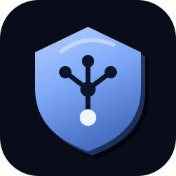
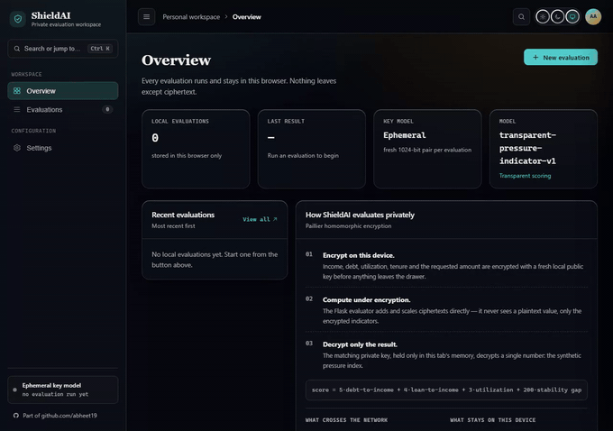
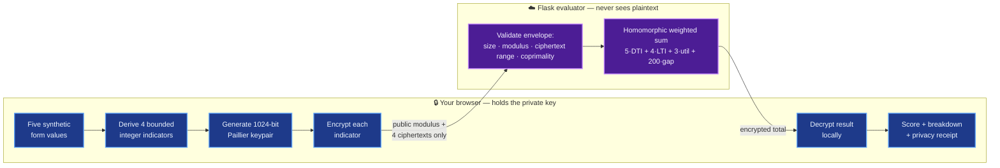

<div align="center">



# ShieldAI

### The server scores your finances **without ever seeing them.**

A working demonstration of **Paillier homomorphic encryption** — the browser encrypts every number, the server does real arithmetic on the ciphertext, and only your device holds the key that can read the answer.

[](https://shieldai-abheet19.fly.dev)
[](https://shieldai-abheet19.fly.dev/version)


</div>

---

<div align="center">



**▶ [Watch the full-quality 60fps reel](docs/media/shieldai-reel.mp4)** &nbsp;·&nbsp; **[Try it live](https://shieldai-abheet19.fly.dev)**

</div>

---

## The problem

Every "just enter your income and we'll evaluate you" form asks you to hand raw financial data to a server you don't control. Even when the server is honest, the data is now _somewhere else_ — logged, cached, breachable.

**ShieldAI shows there is another way.** With partially homomorphic encryption, the server can compute a weighted score over your figures while they stay encrypted the entire time. It adds and scales ciphertext, returns an encrypted total, and only the browser — which alone holds the private key — decrypts the final number.

> This is an **educational** demonstration with **synthetic** inputs. It is not a lending, eligibility, credit-scoring, or financial-advice product, and 1024-bit Paillier is deliberately below production key sizes so the demo stays snappy.

## What you're looking at in the reel

1. **Overview workspace** — KPI tiles (local evaluations, last result, ephemeral key model) and the numbered _"How ShieldAI evaluates privately"_ explainer, spelling out exactly what crosses the network and what never leaves your device.
2. **New evaluation** — five synthetic values are typed in, a fresh 1024-bit Paillier keypair is generated _in the browser_, the derived indicators are encrypted, and a real round trip to the Flask evaluator returns an encrypted total that is decrypted locally to **37.5 / 100** with a full contribution breakdown and privacy receipt.
3. **The nav** — the stored evaluation appears in the Evaluations table and detail drawer; Settings exposes the key model, theme, and history controls. History lives only in this browser's `localStorage`.

## Quick start

```powershell
# 1. Install (Python backend + Node verification tooling)
py -m venv .venv
.\.venv\Scripts\python.exe -m pip install -r requirements-dev.txt
npm install

# 2. Test
.\.venv\Scripts\python.exe -m pytest -q          # 8 backend contract tests
npm run verify:browser                            # real-browser encrypted flow

# 3. Run
.\.venv\Scripts\python.exe -m flask --app app run
```

Open **http://127.0.0.1:5000**. There is no bundler, framework, or build step — the frontend is Flask-rendered HTML plus vanilla ES modules, and both the glass design tokens and the Paillier browser library are vendored under `static/vendor/`, so runtime UI and cryptography never depend on a mutable CDN.

Useful endpoints:

| Endpoint                           | Purpose                                                                                |
| ---------------------------------- | -------------------------------------------------------------------------------------- |
| `GET /`                            | The single-page glass workspace                                                        |
| `GET /health`                      | Architecture, persistence model, and request budget                                    |
| `GET /version`                     | The exact 40-char source commit baked into the image — the authoritative release proof |
| `POST /api/v1/private-evaluations` | Accepts **only** `{ public_key, encrypted_values }`; rejects any raw field             |

## Demo

Regenerate the reel yourself against the live site (or a local build):

```powershell
npx playwright install chromium                   # once
node tools/capture-reel60.mjs                      # → docs/media/shieldai-reel.mp4 + shieldai-demo.gif
# SHIELDAI_URL=http://127.0.0.1:5000 node tools/capture-reel60.mjs   # against local
```

`tools/capture-reel60.mjs` drives the live deployment with Playwright, records the exact showcase flow above, then uses ffmpeg's `minterpolate` filter to produce a genuinely smooth **60fps** H.264 MP4 (~1.6 MB, 1280px wide) and a lean looping GIF for this README.

## How it works



The **only** things that cross the network are a public Paillier modulus and four encrypted indicators; the reply is a single encrypted number. Raw income, debt, utilization, employment tenure, the requested amount, and — always — the private key stay on the device.

## System design

**Why Paillier?** Paillier is an _additively_ homomorphic cryptosystem: given ciphertexts, anyone holding just the public key can compute `Enc(a) · Enc(b) = Enc(a + b)` and `Enc(a)^k = Enc(k·a)`. That is exactly — and only — the algebra a linear weighted sum needs, which is why the transparent scoring model is a weighted sum by design:

```
score = 5·debt-to-income-bps + 4·loan-to-income-bps + 3·utilization-bps + 200·stability-gap-months
```

The browser derives four bounded integer indicators, encrypts them, and the server evaluates the weighted combination entirely on ciphertext (`result += Enc(indicator) * weight`) starting from a fresh `Enc(0)`. It literally cannot see a plaintext value or the result — it has no private key.

**The trust boundary is the whole point.** The design is honest-but-curious safe by construction, and the code makes the boundary explicit and testable:

- **Ephemeral keys.** A new keypair is generated per evaluation, lives only in tab memory, and is discarded the instant decryption finishes. There is no long-lived key to steal or rotate.
- **The server refuses raw data.** `EncryptedEvaluation.from_payload` accepts _exactly_ `{public_key, encrypted_values}` and nothing else — any extra or raw field is a 400.
- **Cheap rejection before expensive math.** Every ciphertext is checked for decimal form, length (≤ 700 chars), range (`0 < c < n²`), and coprimality with the modulus, and the modulus must be an odd 1024-bit integer — all _before_ any modular exponentiation, and invalid envelopes never consume the CPU quota.
- **DoS bounds.** 12 KB request cap, a process-local budget of 8 evaluations/client/hour keyed off Fly's trusted `Fly-Client-IP`, and `MAX_CONTENT_LENGTH` enforcement.
- **Privacy-safe observability.** Every response carries a request ID and `Server-Timing`; structured logs contain method, route template, status, duration, and that ID — never a value, ciphertext, key, or result.
- **No secrets, no database, no LLM.** The evaluator is stateless, stores nothing, makes no external model calls, and sends `Cache-Control: no-store`.

**What this deliberately is _not_:** client ciphertexts are not proofs of honest, bounded plaintext — there is no zero-knowledge range proof, no malicious-client protection, no replay binding, and 1024-bit keys are a timed-demo choice. Paillier enables addition and scalar multiplication on ciphertext; it does not turn this into end-to-end secure lending or arbitrary encrypted computation.

## Code map

| Path                                           | Responsibility                                                                                              |
| ---------------------------------------------- | ----------------------------------------------------------------------------------------------------------- |
| `app.py`                                       | Routes, envelope validation, quota, the homomorphic weighted sum, security headers, payload-free logging    |
| `templates/index.html`                         | The glass workspace: sidebar nav, Overview/Evaluations/Settings screens, command palette, and both drawers  |
| `static/shield-client.js`                      | Validation, indicator derivation, browser keygen, encrypt → request → decrypt → normalize, and all UI state |
| `static/vendor/`                               | Vendored Paillier implementation (+ license) and the shared glass design tokens                             |
| `tools/capture-reel60.mjs`                     | Playwright + ffmpeg 60fps reel capture against the live site                                                |
| `tests/`, `tools/verify-workflows.mjs`         | Backend contract tests and the real-browser end-to-end flow                                                 |
| `Dockerfile`, `fly.toml`, `.github/workflows/` | Unprivileged image with baked source identity, Fly config, and CI                                           |

## Verification

The redesigned glass workspace passes the full backend suite (8/8), a nineteen-group real-browser gate (every CTA and keyboard path, the real encrypted round trip end to end at `37.5/100`, 429/malformed recovery, theme persistence, a 320px layout with zero horizontal overflow, 24px minimum touch targets), a 30-request bounded-concurrency probe, Ruff / ESLint / Prettier / npm audit / pip-audit, and a from-scratch production Docker build with a container smoke test of `/`, `/health`, and `/version`. A prior candidate scored Lighthouse **100 / 100 / 100 / 100** (FCP 1.3s, LCP 1.4s, TBT 0ms, CLS 0). See [`docs/USAGE.md`](docs/USAGE.md), [`docs/TESTING.md`](docs/TESTING.md), and [`docs/STUDY_GUIDE.md`](docs/STUDY_GUIDE.md). These are controlled observations, not formal certifications.

## Deployment

Deployed on **Fly.io** (scale-to-zero, so the first hit after idle cold-starts). The image bakes `GITHUB_SHA` as `SHIELDAI_SOURCE_COMMIT`; treat a release as identified only when the public `/version` commit equals the reviewed Git commit. Record the current endpoint value in dated release evidence rather than hard-coding a deployment snapshot in this README. Before any wider, non-educational launch: edge/WAF rate limiting, authentication, retained monitoring, an independent accessibility review, a 2048-bit key decision, and external cryptographic review.

---

<div align="center">

Part of the build at **[github.com/abheet19](https://github.com/abheet19)** — one shared glass design language across every project.

</div>
