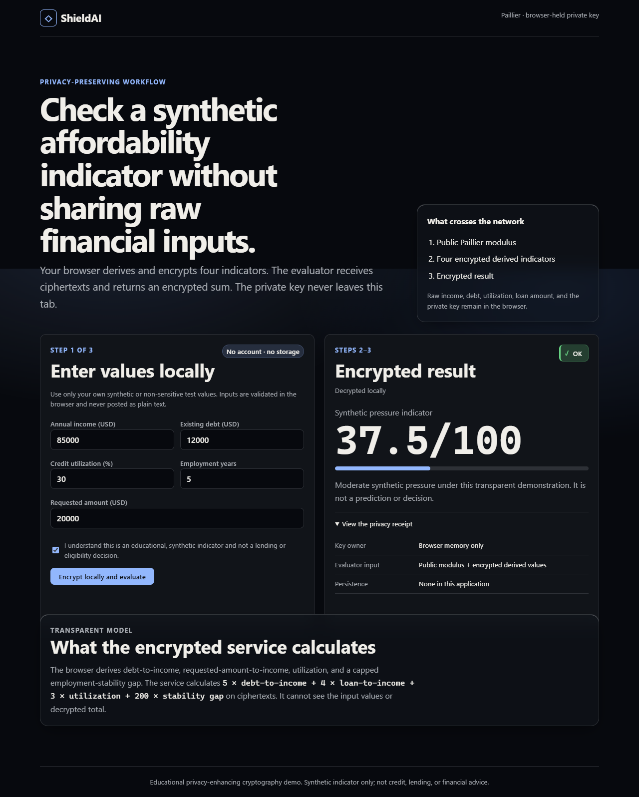
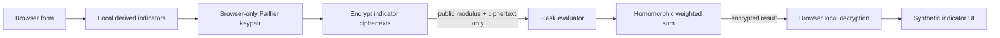

# ShieldAI — browser-private-key homomorphic-computation demo


<details><summary>Inspect the final privacy receipt</summary>



</details>

ShieldAI is an educational demonstration of **Paillier partial homomorphic encryption**. It computes a transparent, synthetic weighted indicator on ciphertext, without the evaluator receiving the raw form values or the private key.

It is **not** a credit-decision product, lending recommendation, security product, or an audited cryptographic system. It must never be used to determine eligibility, pricing, or advice.

## User flow

1. A person enters five synthetic values locally in the browser and confirms the educational-demo notice.
2. Browser JavaScript derives four bounded integer indicator values.
3. The browser generates a 1024-bit Paillier key pair in memory. The private key never leaves the browser.
4. The browser encrypts the four derived indicators and sends only the public modulus and ciphertexts to Flask.
5. Flask validates the envelope, performs the transparent weighted sum on ciphertext, and returns an encrypted result.
6. The browser decrypts the result locally, renders the synthetic score, and discards the key when the page is closed.

## Architecture



## Security and cost boundaries

- The evaluator rejects raw financial fields, unknown fields, even or non-1024-bit moduli, malformed ciphertexts, and bodies larger than 12 KB.
- A client may make at most eight evaluations per hour per running process. Fly's `Fly-Client-IP` header is used for the client bucket; a production public launch should add an edge/WAF rate limit because process-local limits do not coordinate across machines.
- The evaluator has no database, stores no applicant data, holds no private key, and sends `Cache-Control: no-store`.
- The service makes no paid LLM, embedding, or external-model API calls. There is no prompt-injection or token-billing path.
- Paillier makes addition and plaintext-coefficient multiplication possible on ciphertext. It does not make this a secure end-to-end lending system or support arbitrary encrypted branching or neural-network inference.

## Run locally

```powershell
py -m venv .venv
.\.venv\Scripts\python.exe -m pip install -r requirements.txt
.\.venv\Scripts\python.exe -m pytest -q
.\.venv\Scripts\python.exe -m flask --app app run
```

Open `http://127.0.0.1:5000`. `GET /health` reports the browser-private-key architecture and request budget. `POST /api/v1/private-evaluations` accepts only the documented encrypted envelope.

## Deployment notes

The current Fly deployment is a demonstrator. Before a wider launch, add edge rate limits, authentication if it is not a public demo, structured observability without sensitive payloads, accessibility review, a 2048-bit performance/security decision, external cryptographic review, threat modeling, model governance, fairness assessment, and legal/compliance review.

## Verification

See [the reproducible testing guide](docs/TESTING.md) for UI scenarios, boundary checks and honest limits. Glass CSS is vendored from the project source with its license, so the deployed design does not depend on mutable CDN `@main` assets.
