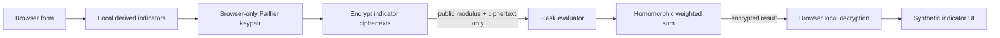

<div align="center">


# ShieldAI — browser-private-key homomorphic-computation demo

[](https://shieldai-abheet19.fly.dev)

</div>

**Live demo:** https://shieldai-abheet19.fly.dev · **Release identity:** https://shieldai-abheet19.fly.dev/version


<details><summary>Inspect the final privacy receipt</summary>


</details>

ShieldAI is an educational demonstration of **Paillier partial homomorphic encryption**. It computes a transparent, synthetic weighted indicator on ciphertext, without the evaluator receiving the raw form values or the private key.

It is **not** a credit-decision product, lending recommendation, security product, or an audited cryptographic system. It must never be used to determine eligibility, pricing, or advice.

## User flow

1. A person opens **New evaluation** from the Overview screen and enters five synthetic values in the drawer, confirming the educational-demo notice.
2. Browser JavaScript derives four bounded integer indicator values.
3. The browser generates a 1024-bit Paillier key pair in memory. The private key never leaves the browser.
4. The browser encrypts the four derived indicators and sends only the public modulus and ciphertexts to Flask.
5. Flask validates the envelope, performs the transparent weighted sum on ciphertext, and returns an encrypted result.
6. The browser decrypts the result locally, renders the synthetic score with its contribution breakdown, and — unless local history is turned off in Settings — adds the record to a browser-only evaluations list. The key itself is still discarded the moment decryption finishes; nothing about the key is ever retained.

## Workspace

The frontend is a Flask-rendered, vanilla-JS glass workspace (no build step, no framework, no bundler): a sidebar with **Overview**, **Evaluations**, and **Settings**, a command palette (`Ctrl`/`⌘``K`), and two drawers (new evaluation, evaluation detail). Every number in it — the stat tiles, the evaluations table, the score trend, the contribution breakdown, the key fingerprint — is computed from real encrypted round trips against the Flask evaluator above; nothing is mocked. History lives only in `localStorage` on the device that ran it, exactly like the protocol it is built on: a person can turn it off or clear it at any time from Settings. The visual language (frosted glass panels, the shared `--accent`/`--accent-2`/`--ok`/`--warn`/`--bad` token ladder, `static/vendor/glass/`) is shared with the other projects at [github.com/abheet19](https://github.com/abheet19), linked from the workspace footer and sidebar.

## Architecture



## Security and cost boundaries

- The evaluator rejects raw financial fields, unknown fields, even or non-1024-bit moduli, malformed ciphertexts, and bodies larger than 12 KB.
- A client may make at most eight evaluations per hour per running process. Fly's `Fly-Client-IP` header is used for the client bucket; a production public launch should add an edge/WAF rate limit because process-local limits do not coordinate across machines.
- The evaluator has no database, stores no applicant data, holds no private key, and sends `Cache-Control: no-store`.
- The service makes no paid LLM, embedding, or external-model API calls. There is no prompt-injection or token-billing path. Every response carries a generated request ID and `Server-Timing`; structured events contain only method, route template, status, duration, and that ID.
- Paillier makes addition and plaintext-coefficient multiplication possible on ciphertext. It does not make this a secure end-to-end lending system or support arbitrary encrypted branching or neural-network inference.

## Run locally

```powershell
py -m venv .venv
.\.venv\Scripts\python.exe -m pip install -r requirements-dev.txt
.\.venv\Scripts\python.exe -m pytest -q
.\.venv\Scripts\python.exe -m flask --app app run
```

Open `http://127.0.0.1:5000`. `GET /health` reports the browser-private-key architecture and request budget. `POST /api/v1/private-evaluations` accepts only the documented encrypted envelope.

## Deployment notes

The public Fly deployment is an educational demonstrator. Its `/version` response exposes the exact 40-character source commit baked into the image; a configured URL alone is not release proof. Before a wider launch, add edge rate limits, authentication if it is not a public demo, retained monitoring and alerting for the current payload-free events, an independent accessibility review, a 2048-bit performance/security decision, external cryptographic review, threat modeling, model governance, fairness assessment, and legal/compliance review.

## Verification

See [the usage guide](docs/USAGE.md), [reproducible testing guide](docs/TESTING.md), and [study guide](docs/STUDY_GUIDE.md). The 2026-09-10 candidate passed eight backend tests, sixteen real-browser flow groups, the 30-request bounded concurrency probe, Ruff, ESLint, Prettier, npm audit, and pip-audit; Lighthouse 13.4.1 scored **100 performance / 100 accessibility / 100 best practices / 100 SEO** on that candidate (FCP 1.3 s, LCP 1.4 s, TBT 0 ms, CLS 0). These are controlled observations, not a formal WCAG certification or a device-fleet guarantee.

The 2026-09-14 glass-workspace redesign re-ran the same backend suite (still 8/8) and a rewritten nineteen-group browser gate against the new sidebar/drawer/command-palette UI — every CTA and keyboard path, the real encrypted round trip end to end (`37.5/100` on the synthetic example), the 429/malformed recovery paths, theme persistence, a 320 px layout with zero horizontal overflow, and 24 px minimum touch targets — plus a from-scratch production Docker build and container smoke test of `/`, `/health`, and `/version`. Glass CSS and Paillier browser code are vendored, so runtime design and cryptography do not depend on mutable CDN assets; Lighthouse was not re-run this pass.
