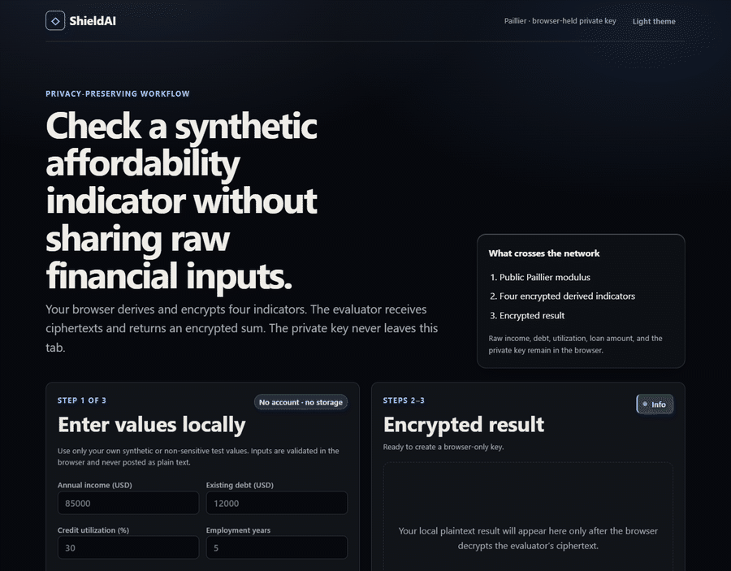
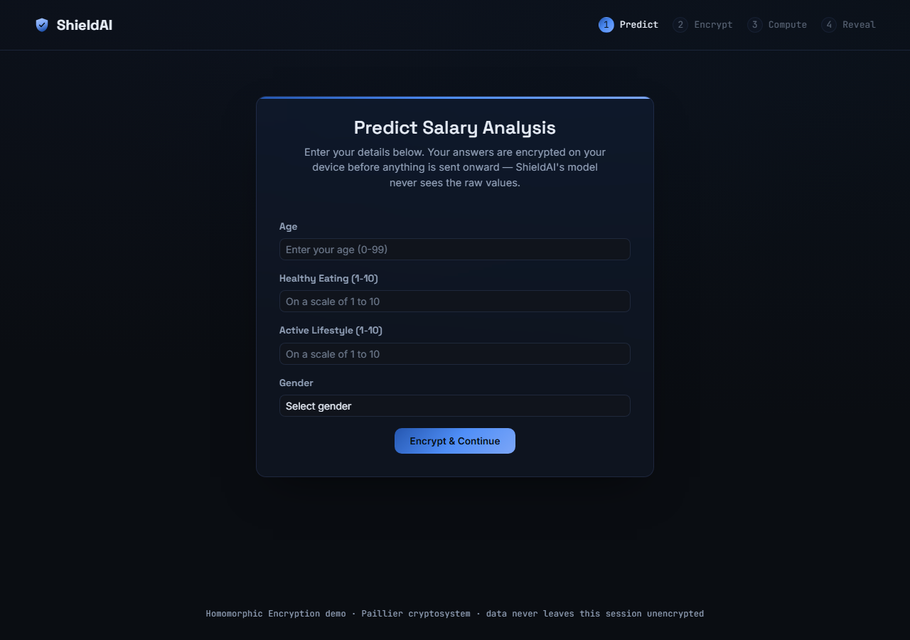

<div align="center">

<br>

# 🛡️ &nbsp;S H I E L D A I

### **Compute on it. Never see it.**

A loan-risk score where the lender's model never once touches a raw number —<br>
every income, debt, and credit figure it computes on is homomorphically encrypted, start to finish.

<br>


<br>

<sub>A personal project by <b><a href="https://github.com/abheet19">Abheet</a></b> — a small, honest demo of partial homomorphic encryption applied to ML inference. Not production-hardened, and not a real underwriting model; see <a href="#-what-it-doesnt-do-yet">what it doesn't do yet</a>.</sub>

<br>



<sub>The whole flow, recorded against the live instance: five financial figures go in, a Paillier keypair is generated, the lender's model computes on the ciphertext, and the last step shows the encrypted blob the lender saw next to the score only the private key can reveal.</sub>

<br>

</div>

> [!NOTE]
> **Live at [shieldai-abheet19.fly.dev](https://shieldai-abheet19.fly.dev/).** Deployed on Fly.io from the
> same Dockerfile in this repo (the Cloud Build config below is left as an alternate GCP path, unused).
> The full `Assess → Encrypt → Compute → Reveal` flow runs end to end against the live instance.

<div align="center">

`Assess` &nbsp;→&nbsp; `Encrypt` &nbsp;→&nbsp; `Compute` &nbsp;→&nbsp; `Reveal`

</div>

---

<details open>
<summary><b>Contents</b></summary>

- [The problem](#the-problem)
- [How it actually works](#-how-it-actually-works)
- [Tech stack](#-tech-stack)
- [Install & run](#-install--run)
- [Design](#-design)
- [Screenshots](#-screenshots)
- [What it doesn't do yet](#-what-it-doesnt-do-yet)

</details>

---

## The problem

Lenders score loan applications on exactly the data an applicant would rather not hand over in the
clear: income, existing debt, credit utilization, employment history, how much you're asking to
borrow. Every one of those is PII a lender has a regulatory and liability incentive to see as
little of as possible — the usual answer is still "we promise to handle it carefully, trust us."
ShieldAI is a small proof that a risk score doesn't require that promise: the lender's model can
compute a real prediction **while every value it touches stays encrypted**, because Paillier
encryption lets you add ciphertexts and scale them by a plaintext constant, and the result decrypts
to exactly what you'd get from doing the arithmetic on the plaintext.

A linear regression model is just weighted sums — which is exactly the arithmetic Paillier
supports. That's the whole trick. This demo happens to score loan risk; the same mechanism applies
to any linear model over sensitive inputs (a salary predictor, a health-risk score, a fraud-score
feature), risk scoring for lending is simply a use case where "the model never sees your raw
financial data" is an actual, well-known ask in fintech rather than a hypothetical one.

---

## 🔍 How it actually works

```mermaid
sequenceDiagram
    participant U as You (browser)
    participant C as cust.py<br/>(your keys)
    participant S as servercalc.py<br/>(the lender)

    U->>C: income, debt, utilization, employment years, loan amount
    C->>C: generate Paillier keypair (public + private)
    C->>C: encrypt each value with the public key
    C->>S: encrypted values + public key only
    Note over S: linmodel.py's regression coefficients<br/>are plaintext — that part is public
    S->>S: encrypted_risk_score = Σ (coefficient × encrypted_value) + intercept
    Note over S: every operand on the right is still ciphertext;<br/>S never reconstructs a plaintext feature
    S->>U: encrypted_risk_score + public key
    U->>U: decrypt with the private key that never left this session
```

Four moving pieces, one per step in the nav bar:

1. **`cust.py` — keys and encryption.** `storeKeys()` generates a fresh Paillier keypair
   (`generate_paillier_keypair()`) and writes it to `custkeys.json`. `serializeDataCustomer()`
   encrypts each feature (annual income, existing debt, credit utilization %, employment years,
   requested loan amount) individually with the public key — five separate ciphertexts, not one
   blob.
2. **`linmodel.py` — the model.** A plain `scikit-learn` `LinearRegression` trained on
   `loan_data.csv`, a small **synthetic** dataset (see [`generate_loan_data.py`](generate_loan_data.py))
   built from a documented linear formula plus noise, not real applicant records. Its coefficients
   and intercept are ordinary floats; they are the *only* thing about the model that's public, and
   floats aren't sensitive the way a customer's raw inputs are.
3. **`servercalc.py` — the computation.** `computeData()` reconstructs the five `EncryptedNumber`
   objects from what the client sent and computes
   `sum(coefficient[i] * encrypted_feature[i] for i in range(5)) + intercept`. Paillier's
   homomorphic properties make `plaintext × ciphertext`, `ciphertext + ciphertext`, and
   `ciphertext + plaintext` all valid operations that stay encrypted — so this line runs real
   modular exponentiation on numbers the server can never read, and the accumulated result is
   still one ciphertext.
4. **`app.py`'s `/result` route — the reveal.** The encrypted risk score comes back to the browser
   along with the public key it was encrypted under. Only the private key — generated in step 1
   and never sent anywhere — can turn that ciphertext into a number like `43.3`. The result page
   clamps that score into 0–100, bands it (low / review / high risk), and shows a gauge plus both
   the ciphertext blob the server computed on and the plaintext only you can see, side by side, so
   the claim is something you can look at rather than just read.

The one place this demo cuts a corner on purpose: `custkeys.json`, `data.json`, and `answer.json`
are server-side files, not session-scoped, so it's a single-user demo, not a multi-tenant service.
That's a demo simplification, not a claim about the crypto.

---

## 🛠 Tech stack

| Layer | Technology | Role |
|---|---|---|
| **Encryption** | [`phe`](https://github.com/data61/python-paillier) | Paillier partial homomorphic encryption — keygen, encrypt, homomorphic add/scale |
| **ML** | scikit-learn | `LinearRegression` trained on `loan_data.csv` (synthetic risk data) |
| **Data handling** | numpy, pandas | Feature/target prep for training |
| **Backend** | Flask | Routes for each step of the pipeline; Jinja2 templates |
| **Frontend** | Bootstrap 5 (grid/forms) + hand-written CSS | Steel-blue glass UI, risk gauge, no JS framework |
| **Server** | Gunicorn | WSGI server for the Docker image |
| **Deploy config** | Docker, Cloud Build, GitHub Actions | Present and tested locally; not currently deployed |

---

## 🚀 Install & run

The pinned `requirements.txt` (`cryptography==2.8`, Flask 1.1.1, etc.) targets Python 3.8 and
doesn't build on current Python — `cryptography==2.8` has no wheel for modern CPython and no
working sdist build under current toolchains. Nothing in this app imports `cryptography` directly,
so the fix is to install current, unpinned versions of what's actually used:

```powershell
git clone https://github.com/abheet19/ShieldAI.git
cd ShieldAI

pip install flask gunicorn phe numpy pandas scikit-learn

python app.py
```

Open `http://localhost:8080` (or whatever port you see in the console — `8080` is sometimes taken
by something else on Windows, in which case pass a different port to `app.run()`).

<details>
<summary><b>Retraining the model</b></summary>

<br>

```powershell
python generate_loan_data.py   # regenerate the synthetic loan_data.csv (optional, already committed)
python train.py                # print coefficients/intercept for inspection
```

`servercalc.py` doesn't load a pickle — it trains fresh from `loan_data.csv` on each `/company`
request via `LinModel()`, so neither script is required to run the app; they exist so the model's
behavior can be regenerated or inspected offline.

</details>

<details>
<summary><b>Regenerating the demo GIF</b></summary>

<br>

The README GIF is a real Playwright recording of the running app, not a mockup — re-record it
whenever the UI changes:

```powershell
npm install                      # dev-only: Playwright, not a runtime dependency of the app
npx playwright install chromium

node tools/record-demo.mjs                              # drive the live instance, capture PNG frames
node tools/record-demo.mjs http://localhost:8080        # ...or record against a local `python app.py`
python tools/build-demo-gif.py                          # frames -> docs/demo/shieldai-demo.gif
```

`record-demo.mjs` writes frames to `docs/demo/frames/` (gitignored) named with the number of ticks
each should hold; `build-demo-gif.py` downscales them to 900px, shares one palette across frames,
and turns those holds into per-frame delays so the GIF dwells on the reveal without paying for
duplicate frames.

</details>

---

## 🎨 Design

Dark ground (`#0A0D12`) with glass-morphism cards, matching the visual family of my other
side projects but with its own palette: a steel-blue gradient family —
`#7CA6F7` → `#4F8EF7` → `#2557B0` — rather than the violet/copper/emerald/rose accents used
elsewhere. The brand mark is a hexagonal shield plate built in the same three-depth-plane
construction (cast / flank / face) as those other marks, which is a deliberate nod to what the
product actually is: privacy as a shield around your data. That same beveled-edge motif reappears
as a thin top facet on every card, rather than drawing a literal shield on each one.

The result page's risk gauge is a plain SVG semicircle (`pathLength="100"` + `stroke-dashoffset`),
colored green/amber/red by band, next to a text badge — so the headline number never depends on
color alone to be readable. Each input field on the assessment form carries a small "why this
matters" tooltip (CSS-only, `data-tip` + `:hover`/`:focus`, so it's keyboard-reachable too).

Typography is Space Grotesk (display) + Inter (body) + JetBrains Mono (keys and ciphertext blocks)
— monospace specifically so a 300-digit ciphertext doesn't visually apologize for its size.

---

## 📸 Screenshots

Captured live from [the deployed app](https://shieldai-abheet19.fly.dev/).



> Steps 2–4 (Encrypt/Compute/Reveal) require a submitted form session to reach, so they're captured
> in the [demo GIF at the top](#-shieldai) rather than as stills here.

---

## 🚧 What it doesn't do yet

- **Synthetic model, not a real underwriting system.** `loan_data.csv` is generated from a
  documented linear formula plus noise (see [`generate_loan_data.py`](generate_loan_data.py)), not
  real applicant or bureau data. The resulting score is a demo of the *mechanism*, not a calibrated
  credit risk model — don't read anything about real loan eligibility into the numbers it returns.
- **Single-user only.** Keys and intermediate payloads are process-wide files
  (`custkeys.json`, `data.json`, `answer.json`), not per-session state — two people using the app
  at once would collide.
- **Regression only.** The README this replaced also claimed classification support; the code in
  this repo only implements linear regression, so that claim is dropped here rather than repeated.
- **No transport encryption.** This is a local demo over plain HTTP — real deployment would need
  TLS in front of it, which is a hosting concern, not a crypto one.

---

<div align="center">

<br>

Built by **[Abheet Singh Isher](https://github.com/abheet19)**

*Privacy shouldn't be a promise. It should be math.*

<br>

</div>
